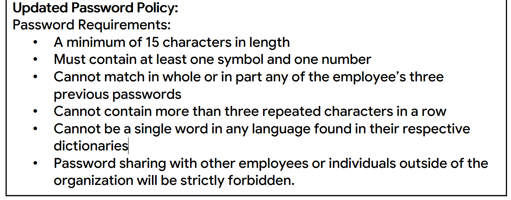

# Security-Risk-Assessment-Report
This is a security risk assessment report assignment completed as part of the Google Cybersecurity Certificate.

## Table of Contents
* [Author](#Author)
* [Techologies](#Technologies)
* [Explaination](#Explaination)
* [Screenshots](#Screenshots)
* [Room for improvement](#Room-for-improvement)
* [Release date](#Release-date)
* [Acknowledgements](#Acknowledgements)
* [Contact](#Contact)

## Author
- Jason Ash, Computer Science Major

## Technologies
I'm currently pursuing an online Cybersecurity Certification through Coursera/Google. I created this security assessment report in LibreOffice and saved it as a PDF, resulting in a format that is more WYSIWYG for viewers. It can be viewed in any Web browser that can view PDF files or in Adobe Acrobat Reader.

## Explaination
- I wrote the security-hardening recommendations in Parts 1 and 2 based on the fictional scenario provided in the course assignment prompt.
- The Scenario section included is largely unaltered from the assignment prompt.
- Although this is a fictional scenario, the recommendations in my report are applicable to the real world and could be used in part by any organization to improve its cybersecurity posture.

## Screenshots

## Room for improvement
As I learn more about cybersecurity, I could revisit and improve this report.

## Release date
28 December 2025

## Acknowledgements
The background scenario information is from the assignment prompt and largely unaltered. I wrote the recommendations in Parts 1 and 2.

## Contact
Jason Ash - wizardofki@gmail.com
